# Removent 发布指南

首发版本：`0.1.2`，协议 v1，桌面 App 支持 Apple Silicon、macOS 13+；独立 relay 同时支持 Linux x86_64 / ARM64 和 macOS Universal。分发采用 Developer ID 签名、公证的 GitHub Releases；这不是 Mac App Store 提交流程。商店提交还需要独立评估沙盒、权限及审核要求，并使用商店更新渠道。

```mermaid
flowchart LR
    A[版本、变更说明与源码 tag] --> B[格式、Clippy、测试]
    B --> C[构建 arm64 App、daemon、tray、安装启动器]
    C --> D[Developer ID 签名]
    D --> E[Apple 公证 App 并 staple]
    E --> F[重新生成 ZIP 与 Retina 背景 DMG]
    F --> G[DMG 签名、公证并 staple]
    G --> H[签名更新清单、生成 SHA256SUMS]
    H --> I[验收 ZIP、DMG、签名、版本、架构]
    I --> J[GitHub stable release]
    J --> K[客户端自动检查]
    K --> L[用户确认、验证下载、会话结束后安装]
```



## 本机发布

维护者直接在 `main` 提交发布代码，无需开 PR。检查通过后从 `main` 创建版本 tag，由发布工作流完成构建、签名、公证和发布。

需要完整 Xcode（含 Metal 工具链）、Rust、Python 3.12+、Swift、OpenSSL 3 和 GitHub CLI。脚本自动选择本机 Xcode，不修改全局 xcode-select。签名脚本优先使用 Homebrew 的 OpenSSL 3，也可通过 `REMOVENT_OPENSSL` 指定可执行文件；不使用 macOS 自带的 LibreSSL。

```sh
brew install openssl@3
python3 -m venv .venv-release
source .venv-release/bin/activate
python3 -m pip install -r scripts/requirements-release.txt
export APPLE_SIGNING_IDENTITY='Developer ID Application: Your Name (TEAMID)'
export NOTARY_KEYCHAIN_PROFILE='your-existing-notary-profile'
export UPDATE_SIGNING_KEY_FILE="$HOME/.config/removent/update-signing-key.pem"
export RELEASE_BUILD_NUMBER=1
bash scripts/release.sh
```

不要把私钥、p12、专用密码或 API key 提交到 Git。可通过 `xcrun notarytool store-credentials` 交互式建立 Keychain profile。也支持 `APPLE_API_KEY_PATH / APPLE_API_KEY_ID / APPLE_API_ISSUER` 或 `APPLE_ID / APPLE_PASSWORD / APPLE_TEAM_ID`。

`RELEASE_BUILD_NUMBER` 是 Apple 的正整数构建号，应随发布递增；营销版本是 `0.1.2`，完整 SemVer 保存在 `RemoventReleaseVersion` 并用于更新验证。CI 使用 workflow run number。

发布前提交源码并创建相同版本 tag。`scripts/publish_release.sh` 要求工作区干净、本地 tag / 远端 tag / HEAD 一致，并重新验证所有产物。CI 在 push `v*` tag 后自动发布；推送 tag 前应先配置并验证所有签名和公证凭据。不要同时运行本地发布与 CI 发布。

```sh
bash scripts/publish_release.sh
```

发布脚本接受 `MAJOR.MINOR.PATCH` 正式版和 `MAJOR.MINOR.PATCH-beta.N` 测试版。正式版设置 `--latest`；beta 设置 `--prerelease --latest=false`，不改变现有正式版本或自动更新源。两者均完整执行签名、公证、跨平台 relay 打包和发布验收，使用不可变版本 tag，不覆盖已发布资产。Apple 营销版本保持数字格式，完整 beta SemVer 保存在 `RemoventReleaseVersion`。例如下一测试版为 `v0.1.3-beta.1`，变更说明位于 `docs/releases/v0.1.3-beta.1.md`。

## 私有 relay 发布资产

同一个正式或 beta tag 还必须包含对应完整版本号的 `removent-relay-vX.Y.Z-{linux-x86_64,linux-aarch64,macos-universal}.tar.gz`，每个包有独立的 `.sha256` 文件。Linux 使用原生 x86_64 / ARM64 runner 构建静态 musl 二进制，检查不依赖动态 ELF 解释器，运行 relay 测试与真实 systemd 生命周期验收。macOS relay 编译 ARM64 与 x86_64 两个 target，合并 Universal 二进制，再由 `scripts/release.sh` 完成 Developer ID 签名、真实 launchd 验收和公证后打包。构建机器需通过 rustup 安装 `aarch64-apple-darwin` 与 `x86_64-apple-darwin` 标准库；本机发布仍在 Apple Silicon 上运行。

`scripts/package_relay.py` 校验版本、文件内容、架构与校验和。发布工作流收齐全部平台资产至 `dist/relay` 后，`scripts/publish_release.sh` 才会将它们与 App 一起发布；缺失资产会失败。本机发布时必须先取回相同 tag 的两个 Linux 包及校验文件并放入 `dist/relay`，不能用 macOS 产物替代。可执行 `python3 scripts/package_relay.py --version v0.1.2 --verify` 预先检查。

用户通过 `scripts/install_relay.sh` 下载已发布二进制，服务器不编译源码。安装器只负责校验和安装；配置与启停由 `removent-relay` 原生 CLI 完成。安装与更新保留身份及凭据，更新后由用户显式 restart。

## GitHub Actions secrets

| Secret | 内容 |
| --- | --- |
| APPLE_CERTIFICATE | Developer ID Application 身份的 p12，base64 编码 |
| APPLE_CERTIFICATE_PASSWORD | p12 导出密码 |
| APPLE_SIGNING_IDENTITY | Developer ID Application 身份名称 |
| UPDATE_SIGNING_KEY | 已与客户端公钥匹配的 Ed25519 PEM 私钥 |
| APPLE_API_KEY_BASE64 | App Store Connect `.p8` 的 base64 |
| APPLE_API_KEY_ID | API key ID |
| APPLE_API_ISSUER | API issuer UUID |

公证 API key 可替换为 Apple ID 那组三个 secrets。私钥只在当前 job 临时文件中出现，退出时清除。不要导出整个钥匙串，只导出用于 Removent 发布的身份。签名 Team ID 固定为 `PB8H83VL3Z`，变更身份需要同时审查更新器和发布验收代码。

CI 使用 `macos-15` arm64 runner、锁定的 Cargo.lock、串行测试、失败即停止。发布任务要求同一提交在 main 的 CI 和 Relay 两个工作流中完整通过检查、开发打包、官网构建及浏览器测试、跨平台 relay 和真实服务验收，再复用构建缓存进行签名构建；不会使用其他提交的检查结果。普通 CI 的 ZIP 明确标记 development/not-notarized，不能替代公开安装包。官网静态文件以 `Removent-website` artifact 保存，托管发布单独进行。

## 自动更新

- 启动 30 秒后检查，之后每 24 小时检查；可关闭，可手动检查。
- 仅使用 GitHub latest 正式渠道的已签名清单，拒绝预发布下载；beta 本机版本可更新到版本号更高的正式版，但不会自动安装其他 beta。没有独立 beta feed。首次正式发布之前，官方 latest 地址返回 404。
- 下载前校验 Ed25519，下载后核对 SHA-256，再验证 Apple Developer ID 证书、Team ID、bundle ID 和包内完整版本。
- 只使用 HTTPS（包括重定向），清单 2 MiB 上限、更新 ZIP 1 GiB 上限，连接和低速超时；失败支持再次下载及断点续传。
- 获取发布列表或清单时，临时网络／服务器错误最多重试两次，每个地址共用 30 秒超时预算；每次响应独立读取，避免重试时拼接损坏的清单。错误提示区分 HTTP 状态、DNS、连接、超时和 TLS 失败，日志记录阶段与状态码，不记录完整更新地址。
- 用户点击安装；会话进行中推迟。先把新 App 暂存到安装目录所在磁盘，再做同磁盘重命名，保留 `.app.old`。
- Launch Services 拒绝启动时回滚。新进程首帧绘制后清理旧版本；尚未实现独立进程的启动健康监测，因此“系统接受启动后，新进程早期崩溃”需要从保留的 `.app.old` 手动恢复，不能称为完整自动崩溃回滚。

## DMG 和图标

DMG 双击挂载；macOS 不允许静默自动执行安装代码。用户双击其中的 Removent，原生启动器确认后安装到 `/Applications`，不可写则使用 `~/Applications`，然后启动。也支持标准拖拽安装。替换正在运行的 App 会提示先退出。

Finder 布局通过 `.DS_Store` 生成，不依赖 Apple Events 或 UI 自动化；背景使用 700×450 / 1400×900 两份 Retina TIFF 图像。

品牌资源位于 `assets/branding/`。`AppIcon.icns` 含 16、32、128、256、512 点的 1×/2×图像；另提供 1024×1024 RGB PNG。图标需在实际 Dock、小尺寸和 App Store Connect 中复核，素材尺寸满足要求不代表整个应用已获商店审核通过。

可编辑 SVG 当前是手工绘制方案，没有调用图像生成 API。重新导出：

```sh
# CairoSVG 需要 cairo；macOS 可使用 brew install cairo。
DYLD_FALLBACK_LIBRARY_PATH=/opt/homebrew/lib python3 scripts/branding.py
```

## Relay 自动更新清单

发布前，`publish_release.sh` 校验三份 relay 归档并运行 `gen_relay_updates.py`，使用同一个 Ed25519 发布密钥为 `relay-latest-linux-x86_64.json`、`relay-latest-linux-aarch64.json`、`relay-latest-macos-universal.json` 签名，再随版本发布。签名覆盖 `removent-relay-v1` 域标识、版本、平台、固定版本下载地址、归档 SHA-256 与解压后二进制 SHA-256（换行分隔，无末尾换行）。客户端与 relay 的编译公钥必须一致；缺少任一平台或签名密钥不匹配会阻止发布。

Relay 更新器只加载签名有效的稳定版本，下载失败或候选版本不能解析当前配置时保持当前服务。首次含此功能的版本须通过现有安装器安装；没有这些清单的旧发布不能作为自动更新来源。
