# Removent beta 发布指南

首版：`0.1.0-beta.1`，Apple Silicon，macOS 13+。分发采用 Developer ID 签名、公证的 GitHub Releases；这不是 Mac App Store 提交流程。商店提交还需要独立评估沙盒、权限及审核要求，并使用商店更新渠道。

```mermaid
flowchart LR
    A[版本、变更说明与源码 tag] --> B[格式、Clippy、测试]
    B --> C[构建 arm64 App、daemon、tray、安装启动器]
    C --> D[Developer ID 签名]
    D --> E[Apple 公证 App 并 staple]
    E --> F[重新生成 ZIP 与 Retina 背景 DMG]
    F --> G[DMG 签名、公证并 staple]
    G --> H[签名更新清单、生成 SHA256SUMS]
    H --> I[验收 ZIP、DMG、签名、版本、架构]
    I --> J[GitHub beta prerelease]
    J --> K[客户端自动检查]
    K --> L[用户确认、验证下载、会话结束后安装]
```



## 本机发布

需要完整 Xcode（含 Metal 工具链）、Rust、Python 3.12+、Swift 和 GitHub CLI。脚本自动选择本机 Xcode，不修改全局 xcode-select。

```sh
python3 -m venv .venv-release
source .venv-release/bin/activate
python3 -m pip install -r scripts/requirements-release.txt
export APPLE_SIGNING_IDENTITY='Developer ID Application: Your Name (TEAMID)'
export NOTARY_KEYCHAIN_PROFILE='your-existing-notary-profile'
export UPDATE_SIGNING_KEY_FILE="$HOME/.config/removent/update-signing-key.pem"
export RELEASE_BUILD_NUMBER=1
bash scripts/release.sh
```

不要把私钥、p12、专用密码或 API key 提交到 Git。可通过 `xcrun notarytool store-credentials` 交互式建立 Keychain profile。也支持 `APPLE_API_KEY_PATH / APPLE_API_KEY_ID / APPLE_API_ISSUER` 或 `APPLE_ID / APPLE_PASSWORD / APPLE_TEAM_ID`。

`RELEASE_BUILD_NUMBER` 是 Apple 的正整数构建号，应随发布递增；营销版本是 `0.1.0`，完整 SemVer 保存在 `RemoventReleaseVersion` 并用于更新验证。CI 使用 workflow run number。

发布前提交源码并创建相同版本 tag。`scripts/publish_release.sh` 要求工作区干净、本地 tag / 远端 tag / HEAD 一致，并重新验证所有产物。CI 在 push `v*` tag 后自动发布；推送 tag 前应先配置并验证所有签名和公证凭据。不要同时运行本地发布与 CI 发布。

```sh
bash scripts/publish_release.sh
```

Beta 标记为 prerelease，且 `--latest=false`，不会占用正式版 latest。每个版本的 ZIP、DMG、清单都使用不可变版本 tag；不移动 beta tag、不覆盖已发布资产。

## GitHub Actions secrets

| Secret | 内容 |
| --- | --- |
| APPLE_CERTIFICATE | Developer ID Application 身份的 p12，base64 编码 |
| APPLE_CERTIFICATE_PASSWORD | p12 导出密码 |
| APPLE_SIGNING_IDENTITY | Developer ID Application 身份名称 |
| UPDATE_SIGNING_KEY | 已与客户端公钥匹配的 Ed25519 PEM 私钥 |
| APPLE_API_KEY_BASE64 | App Store Connect `.p8` 的 base64 |
| APPLE_API_KEY_ID | API key ID |
| APPLE_API_ISSUER | API issuer UUID |

公证 API key 可替换为 Apple ID 那组三个 secrets。私钥只在当前 job 临时文件中出现，退出时清除。不要导出整个钥匙串，只导出用于 Removent 发布的身份。签名 Team ID 固定为 `PB8H83VL3Z`，变更身份需要同时审查更新器和发布验收代码。

CI 使用 `macos-15` arm64 runner、锁定的 Cargo.lock、串行测试、失败即停止。普通 CI 的 ZIP 明确标记 development/not-notarized，不能替代公开安装包。

## 自动更新

- 启动 30 秒后检查，之后每 24 小时检查；可关闭，可手动检查。
- Beta 通过 GitHub releases API 选择最高 SemVer 的 beta 或正式版；正式版使用 GitHub latest 正式渠道。忽略 draft、alpha 和没有完整清单的 release。
- GitHub releases API 单页最多 100 项；需要继续支持长期不升级的 beta 时，可增加分页或引入独立签名 feed。
- 下载前校验 Ed25519，下载后核对 SHA-256，再验证 Apple Developer ID 证书、Team ID、bundle ID 和包内完整版本。
- 只使用 HTTPS（包括重定向），清单 2 MiB 上限、更新 ZIP 1 GiB 上限，连接和低速超时；失败支持再次下载及断点续传。
- 用户点击安装；会话进行中推迟。先把新 App 暂存到安装目录所在磁盘，再做同磁盘重命名，保留 `.app.old`。
- Launch Services 拒绝启动时回滚。新进程首帧绘制后清理旧版本；尚未实现独立进程的启动健康监测，因此“系统接受启动后，新进程早期崩溃”需要从保留的 `.app.old` 手动恢复，不能称为完整自动崩溃回滚。

## DMG 和图标

DMG 双击挂载；macOS 不允许静默自动执行安装代码。用户双击其中的 Removent，原生启动器确认后安装到 `/Applications`，不可写则使用 `~/Applications`，然后启动。也支持标准拖拽安装。替换正在运行的 App 会提示先退出。

Finder 布局通过 `.DS_Store` 生成，不依赖 Apple Events 或 UI 自动化；背景使用 700×450 / 1400×900 两份 Retina TIFF 图像。

品牌资源位于 `assets/branding/`。`AppIcon.icns` 含 16、32、128、256、512 点的 1×/2×图像；另提供 1024×1024 RGB PNG。图标需在实际 Dock、小尺寸和 App Store Connect 中复核，素材尺寸满足要求不代表整个应用已获商店审核通过。

可编辑 SVG 当前是手工绘制方案，没有调用图像生成 API。重新导出：

```sh
# CairoSVG 需要 cairo；macOS 可使用 brew install cairo。
DYLD_FALLBACK_LIBRARY_PATH=/opt/homebrew/lib python3 scripts/branding.py
```
